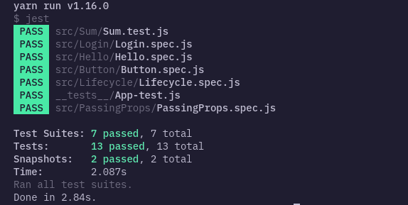

# React Native Testing

<p align="center">
  <a href="https://github.com/tuantvk/WtfReactNativeTesting/issues">
    
  </a>
  <a href="#">
    
  </a>
  <a href="#">
    
  </a>
  <a href="https://github.com/tuantvk/WtfReactNativeTesting/blob/master/LICENSE">
    
  </a>
</p>

<p align="center">
  
<p>


## Table Contents

1. [ Setting. ](#setting)
2. [ Hello world testing ](#hello-world-testing)
3. [ Text and Props Testing ](#text-and-props-testing)
4. [ TextInput Testing ](#textinput-testing)
5. [ Lifecycle Methods Testing ](#lifecycle-methods-testing)
6. [ Basics of snapshot testing ](#basics-of-snapshot-testing)
7. [ Events Testing ](#events-testing)
8. [ Events Hook Testing ](#events-hook-testing)
9. [ Enzyme Members Testing](#enzyme-members-testing)
10. [ Wrap up ](#wrap-up)


### More examples: [Elk - Documents for React Native testing](https://elk.netlify.app/)


## What are we unit testing exactly ? :rotating_light:

We're using **"unit testing"** to refer to tests of functions and plain JavaScript objects, independent of the React Native framework. This means that we aren't testing any components that rely on React Native.


<p align="center">
  
<p>


For example, a unit could be individual methods and functions in classes or really any small pieces of functionality. We mock out dependencies in these tests so that we can test individual methods and functions in isolation.


These test are written using testing frameworks and for this article i will be using [Jest](https://jestjs.io/), javascript testing framework together with [Enzyme](https://airbnb.io/enzyme/) and [React Native Testing Library](https://github.com/callstack/react-native-testing-library).


## Setting

### Install

If you use **React Native CLI** installs the **Jest** testing framework by default. But if you're using Expo we need to install it manually.

```sh
yarn add -D enzyme enzyme-adapter-react-16
```

More:
```sh
yarn add react-dom react-native-testing-library
```

Create new file `jestSetup.js` in root and add to jest in `package.json`:

```js
// jestSetup.js
import { configure } from 'enzyme';
import Adapter from 'enzyme-adapter-react-16';

configure({
  adapter: new Adapter()
});
```

```json
// package.json
"jest": {
  "preset": "react-native",
  "setupFilesAfterEnv": [
    "<rootDir>/jestSetup.js"
  ]
}
```

Refer to [Jest configuration](https://jestjs.io/docs/en/configuration.html) for more info.

<p align="center">
  
<p>

With this, our setup should be done :tada: :tada: :tada:

### Let's get started by writing a test for a hypothetical function that adds two numbers.

First, create a [Sum.js](src/Sum/Sum.js) file:
```js
'use strict'

function sum(a, b) {
  return a + b;
};

module.exports = sum;
```

Create a file named [Sum.test.js](src/Sum/Sum.test.js), this will contain our actual test.
```js
const Sum = require('./Sum');

test('adds 1 + 2 to equal 3', () => {
  expect(Sum(1, 2)).toBe(3);
});
```

Finally, run yarn test and Jest will print this message:

```sh
PASS  ./Sum.test.js
✓ adds 1 + 2 to equal 3 (5ms)
```

<p align="center">
  
<p>


## Testing React Native components

Component tests are tests of individual React Native components apart from where they are used in an application.
I will cover rendering elements, testing props, finding nested elements, updating props, and calling event handlers.

I use `react-native-testing-library` allows you to test React Native components, verifying the component tree they render and allowing you to interact with them.


## Hello world testing

I have component [Hello.js](src/Hello/Hello.js) and enter the following contents:

```js
// Hello.js
import React from 'react';
import { Text } from 'react-native';

const Hello = () => <Text>Hello, world!</Text>;

export default Hello;
```

Next, then add a [Hello.spec.js](src/Hello/Hello.spec.js) file in it with the following contents:

```js
// Hello.spec.js
import React from 'react';
import { render } from 'react-native-testing-library';
import Hello from './Hello';

describe('Hello', () => {

  it('renders the correct message', () => {
    const { queryByText } = render(<Hello />);
    expect(queryByText('Hello, world!')).not.toBeNull();
  });

});
```

Run test with `yarn test`


## Text and Props Testing

Create a file [PassingProps.js](src/PassingProps/PassingProps.js) and enter the following:

```js
import React from 'react';
import {
  View,
  Text
} from 'react-native';

const PassingProps = ({ name, age = 30 }) => (
  <View>
    <Text testID="name">{`Hello, ${name}!`}</Text>
    <Text testID="age">{`Age ${age}`}</Text>
  </View>
);

export default PassingProps;
```

Let's test that it displays the right message when a name and age is passed in as a prop.
If age `undefined` `default age = 30`
Create a file [PassingProps.spec.js](src/PassingProps/PassingProps.spec.js) and add the following:

```js
import React from 'react';
import { render } from 'react-native-testing-library';
import PassingProps from './PassingProps';

describe('PassingProps', () => {

  it('displays the passed-in name', () => {
    const { queryByText } = render(
      <PassingProps name="Jinx" />
    );
    
    expect(queryByText('Hello, Jinx!')).not.toBeNull();
    expect(queryByText('Age 30')).not.toBeNull();
  });

  it('displays the passed-in age', () => {
    const { queryByText } = render(
      <PassingProps name="Jinx" age="25" />
    );
    expect(queryByText('Age 25')).not.toBeNull();
  });
  
});
```

Here's what's going on:

- `render()` renders the component to an in-memory representation that doesn't require environment.
- `queryByText()` finds a child component that contains the passed-in text.
- `expect()` creates a Jest expectation to check a condition. 
- `not.toBeNull()` checks that the value is not null, which means that an element with that text was found.


## TextInput Testing :pencil:

I have form [Login.js](src/Login/Login.js):

```js
import React, { useState } from 'react';
import {
  View,
  Text,
  TextInput,
  Button,
} from 'react-native';

const Login = props => {

  const [username, _setUsername] = useState('');
  const [password, _setPassword] = useState('');
  const [phone, _setPhone] = useState('');

  _onSubmitLogin = () => {
    // Do something...

    const { login } = props;

    if (login) {
      login({ username, password });
    }

  }

  return (
    <View>
      <Text>Login</Text>
      <TextInput
        testID="username"
        placeholder="Username"
        value={username}
        onChangeText={text => _setUsername(text)}
      />
      <TextInput
        testID="password"
        placeholder="Password"
        value={password}
        secureTextEntry={true}
        onChangeText={text => _setPassword(text)}
      />
      <TextInput
        testID="phone"
        placeholder="Phone"
        value={phone}
        keyboardType="numeric"
        maxLength={10}
        onChangeText={text => _setPhone(text.replace(/[^0-9]/g, ''))}
      />
      <Button
        title="Submit"
        testID="btnSubmit"
        onPress={_onSubmitLogin}
      />
    </View>
  );
}

export default Login;
```

Let's start by simulating entering `username`, `password`, `phone` and pressing the `button submit`:

```js
import React from 'react';
import { render, fireEvent } from 'react-native-testing-library';
import Login from './Login';

describe('Login', () => {

  describe('change text login', () => {
    it('change text username and password', () => {
      const { getByTestId } = render(<Login />);

      // use fireEvent change value TextInput
      fireEvent.changeText(getByTestId('username'), 'admin');
      fireEvent.changeText(getByTestId('password'), 'admin@123');

      // use toEqual check value TextInput
      expect(getByTestId('username').props.value).toEqual('admin');
      expect(getByTestId('password').props.value).toEqual('admin@123');
    });


    it('change text phone input ', () => {
      const { getByTestId } = render(<Login />);

      fireEvent.changeText(getByTestId('phone'), '0123456789');

      expect(getByTestId('phone').props.value).toEqual('0123456789');
    });


    it('change text is string to phone input ', () => {
      const { getByTestId } = render(<Login />);

      fireEvent.changeText(getByTestId('phone'), 'isstring');

      expect(getByTestId('phone').props.value).toEqual('');
    });

  });


  describe('Submit form login', () => {

    it('on submit login', () => {
      const data = { "password": "123456", "username": "admin@123" }
      const submitHandler = jest.fn();
      const { getByTestId } = render(

        // passing prop to Login component
        <Login login={submitHandler} />

      );

      fireEvent.changeText(getByTestId('username'), 'admin@123');
      fireEvent.changeText(getByTestId('password'), '123456');

      expect(getByTestId('username').props.value).toEqual('admin@123');
      expect(getByTestId('password').props.value).toEqual('123456');

      // use fireEvent.press call Button submit
      fireEvent.press(getByTestId('btnSubmit'));

      // checking ouput data equal input
      expect(submitHandler).toHaveBeenCalledWith(data);
    });

  })

});
```

- `getByTestId` lets us retrieve an element by the `testID prop`. 
- `fireEvent` lets us fire an event on an element specifically here we want the `changeText` event on the text field, and the press event on the button.
- `toEqual('')` checking value TextInput when change.

The other thing we want to confirm is that the `login` action is called. We can do this using a Sinon spy. A spy allows us to inspect whether it has been called, and with what arguments.

```js
// Login.js
...
if (login) {
  login({ username, password });
}
...
```

```js
// Login.spec.js
...
const submitHandler = jest.fn();
const { getByTestId } = render(
  <Login login={submitHandler} />
);
...

expect(submitHandler).toHaveBeenCalledWith(data);
```


## Lifecycle Methods Testing :hammer:

<p align="center">
  
<p>


Component that loads some data from a service upon mount and displays it, [Lifecycle.js](src/Lifecycle/Lifecycle.spec.js):

```js
import React, { useState, useEffect } from 'react';
import {
  View,
  Text,
} from 'react-native';

const NUMBERS = ['one', 'two'];

const Lifecycle = () => {

  const [numbers, _setNumbers] = useState([]);

  // use HOOK
  useEffect(() => {
    _setNumbers(NUMBERS);
  });

  return (
    <View>
      {
        numbers.map((num, index) => (
          <Text key={index}>{num}</Text>
        ))
      }
    </View>
  );
}

export default Lifecycle;
```

Here's my test:

```js
import React from 'react';
import { render } from 'react-native-testing-library';
import Lifecycle from './Lifecycle';

describe('Lifecycle', () => {

  it('loads number from useEffect', () => {
    const { queryByText } = render(<Lifecycle />);

    expect(queryByText('one')).not.toBeNull();
    expect(queryByText('two')).not.toBeNull();
  });

});
```

If `useEffect` render after `render()` because the calls to `queryByText()` return null and the text is not found. 
This is because the test doesn't wait for the service to return data.

How can we fix this ? :bug:

```js
...
const { queryByText, debug } = render(<Lifecycle />);
...

return new Promise((resolve, reject) => {
  setTimeout(() => {
    expect(queryByText('one')).not.toBeNull();
    expect(queryByText('two')).not.toBeNull();
    resolve();
  }, 1000);
});
```


This works, but there are a few downsides:

- If the request takes too long, the test can fail sometimes.
- Which slows down your whole test suite.
- If the remote server goes down, your test will fail.


## Basics of snapshot testing :racehorse:

Lets setup a basic [Button](src/Button/Button.js) component so that we try out snapshot testing it.

```js
import React, { useState } from 'react';
import {
  TouchableOpacity,
  Text,
} from 'react-native';

const Button = ({ label }) => {

  const [disabled, _setDisabled] = useState(false);

  _onSubmit = () => {
    // Do something...

    _setDisabled(true);

  }

  return (
    <TouchableOpacity
      disabled={disabled}
      onPress={_onSubmit}>
      <Text>
        {disabled ? 'Loading...' : label}
      </Text>
    </TouchableOpacity>
  );
}

export default Button;
```

Now let’s create the test file [Button.spec.js](src/Button/Button.spec.js)

```js
...

describe('Rendering', () => {
  it('should match to snapshot', () => {
    const component = shallow(<Button label="Submit" />)
    expect(component).toMatchSnapshot()
  });

  it('Button renders correctly', () => {

    const tree = renderer.create(<Button />).toJSON();
    expect(tree).toMatchSnapshot();

  });
});
```

Jest will accept both extensions and will append file extension as necessary for auto generated files such as snapshots.

Since this is the first time we run this snapshot test, Jest will create a snapshot file for us inside the folder `__snapshots__`.

<p align="center">
  
<p>


## Events Testing

We can either check that the state was updated by accessing it directly through the root instance’s `instance.state` or by checking the rendered text value.

```js
// Events.js
import React from 'react';
import {
  View,
  Text,
  TouchableOpacity,
} from 'react-native';

class Events extends React.Component {

  state = {
    counter: 1,
  }

  _setCounter = () => {
    this.setState(prevState => (
      { counter: prevState.counter + 1 }
    ));
  }

  render() {
    const { counter } = this.state;
    return (
      <View>
        <TouchableOpacity onPress={this._setCounter}>
          <Text>{counter}</Text>
        </TouchableOpacity>
      </View>
    );
  }
}

export default Events;
```

```js
// Events.spec.js
...

it('updates counter when clicked', () => {

  const inst = renderer.create(<Events />);
  const button = inst.root.findByType(TouchableOpacity);
  const text = inst.root.findByType(Text);

  expect(inst.root.instance.state.counter).toBe(1);

  button.props.onPress();
  
  expect(text.props.children).toBe(2);
});
```

We render the `<Events>`, we can use `findByType` to find the `TouchableOpacity` and call its onPress function.


## Events Hook Testing

How to testing component use Hooks ? For example:

```js
// EventsHook.js
import React, { useState } from 'react';
import {
  View,
  Text,
  TouchableOpacity,
} from 'react-native';

const EventsHook = () => {

  const [number, _setNumber] = useState(1);

  return (
    <View>
      <TouchableOpacity onPress={() => _setNumber(number + 1)}>
        <Text>{number}</Text>
      </TouchableOpacity>
    </View>
  );
}

export default EventsHook;
```

```js
// EventsHook.spec.js
import React from 'react';
import {
  Text,
  TouchableOpacity,
} from 'react-native';
import renderer from 'react-test-renderer';
import { waitForElement } from 'react-native-testing-library';
import EventsHook from './EventsHook';

describe('EventsHook', () => {

  it('calls setCount with count + 1', async () => {

    let inst;
    inst = renderer.create(<EventsHook />)

    await waitForElement(() => {
      const button = inst.root.findByType(TouchableOpacity);
      const text = inst.root.findByType(Text);

      button.props.onPress();

      expect(text.props.children).toBe(2);

    })

  });

});
```


## Enzyme Members Testing


<p align="center">
  
<p>


This is example for use **Enzyme** for testing React Native Component.
I have component [Members.js](src/Members/Members.js) and enter the following contents:

```js
// Members.js
import React from 'react';
import { View, Text } from 'react-native';


const Members = ({ members }) => {

    return (
        <View>
            {members.map(member => (
                <Text key={member.id} testID="memberDetail">{member.name}</Text>
            ))}
        </View>
    )
}


export default Members;
```

Members Component receive a props **members** include `id` key and `name` key, render each item member with `testID="memberDetail"`

```js
// Members.spec.js
import React from 'react';
import { shallow } from 'enzyme';
import toJson from 'enzyme-to-json';

import Members from './Members';

const members = [{ id: 1, name: 'Daphne', }, { id: 2, name: 'Margret', }];


describe('Members Component', () => {
    it('should render without issues', () => {
        const component = shallow(
            <Members members={members} />
        );

        expect(component.length).toBe(1);
        expect(toJson(component)).toMatchSnapshot();
    });

    it('should render all item in members', () => {
        const wrapper = shallow(
            <Members members={members} />
        );

        expect(wrapper.find({ testID: 'memberDetail' }).length).toBe(2);
    });

    it('should render correct names', () => {
        const wrapper = shallow(
            <Members members={members} />
        );

        wrapper.find({ testID: 'memberDetail' }).forEach((node, index) => {
            expect(node.props().children).toBe(members[index].name);
        });
    });

});
```


Result test final :zap: :zap:

<p align="center">
  
<p>


## :sparkles: Wrap up

These are few basic ways you can start unit testing your React Native codebase with Jest and Enzyme. They both have great documentation so there is no reason you should not unit test your codebase anymore.
